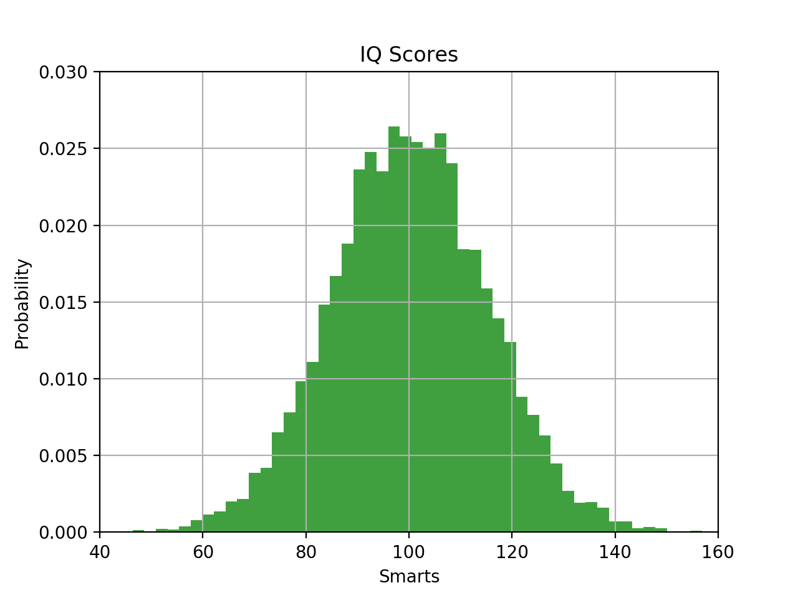
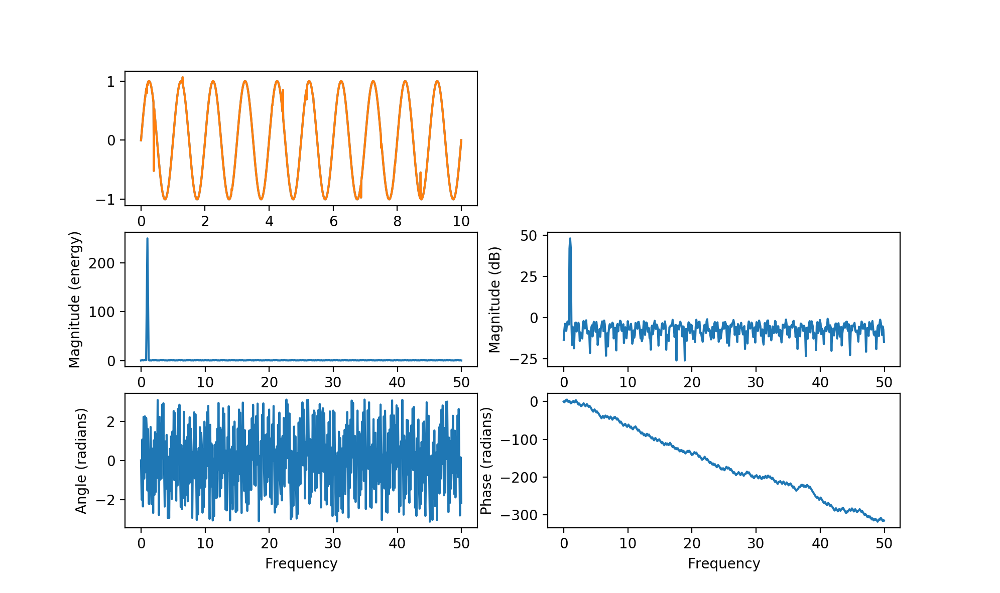

# Expyplot

Inspired by this project:
https://github.com/JordiPolo/explot, but I wanted something more transparent.

<b>Documentation can be found at</b> [https://hexdocs.pm/expyplot](https://hexdocs.pm/expyplot).

Expyplot allows you to use 'all' of the functions in matplotlib.plot (in reality, there are some that I left out because they don't make any sense in this context, or
are deprecated).

Unfortunately, I have not tested anywhere near all of the functions, but they should mostly work. If any don't work, please open an issue, or better yet,
make a fix and open a pull request! This library is simple enough that you should be able to grok it without too much effort.

Perhaps the most limiting thing about this library is that it currently has to convert return values from the matplotlib functions into strings before
sending them back to Elixir, so rather than returning `true`, you will get `"True"`, and good luck piecing back to gether complicated objects. The reason I went this route
is that JSON is unable to parse pretty much any complicated data type that comes back from a matplotlib function, and I didn't feel like writing a JSON parser. If you
want to do something about it, please by all means, write a JSON parser capable of serializing all the different return types from matplotlib functions: the python
side of this library is very simple - it is located in priv/mat.py.

## Differences

Unfortunately (or rather, fortunately if we are celebrating linguistic diversity!), I could not attain complete transparency. This is a list of some notable differences
between this library and the real matplotlib.pyplot:

- Return values are strings currently
- Variable arguments must be wrapped in a list, so: `plt.plot(a, b)` becomes `Plot.plot([a, b])`
- Named args and keyword args are atoms: `Plot.grid(b: true)`
- Keyword args that are not keyword only arguments must be written with keywords, you can't do them positionally, so while `plt.grid(True)` works in Python,
  you have to name the argument in Elixir: `Plot.grid(b: true)`; if you ever get the error: "argument error: :erlang.++(something, [])", this is the reason. You need
  to rewrite the argument list as a keyword list.
- Any keyword argument or named argument that starts with a capital letter needs to be renamed with an underscore: `Fs` -> `:_Fs`

## Examples

To run the examples, start an iex -S mix session and run:

```elixir
Code.load_file "./path/to/example/EXAMPLE.exs"
```

### Histogram

```elixir
defmodule HistogramExample do
  alias Expyplot.Plot

  {mu, sigma} = {100, 15}
  x = 1..10_000 |> Stream.map(fn(_) -> Statistics.Distributions.Normal.rand(mu, sigma) end) |> Enum.to_list

  Plot.hist(x, bins: 50, normed: 1, facecolor: :green, alpha: 0.75)
  Plot.xlabel("Smarts")
  Plot.ylabel("Probability")
  Plot.title("IQ Scores")
  Plot.axis_set([40, 160, 0, 0.03])
  Plot.grid(b: true)

  Plot.show()
end
```


### Subplots

```elixir
defmodule SpectralExample do
  alias Expyplot.Plot

  dt = 0.01
  fs = 1 / dt
  t = Stream.unfold(0, fn(acc) -> {acc, acc + dt} end) |> Stream.take_while(&(&1 < 10)) |> Enum.to_list
  nse = t |> Enum.map(fn(_) -> Statistics.Distributions.Normal.rand() end) |> Enum.to_list
  r = t |> Enum.map(&(Statistics.Math.exp(- &1 / 0.05)))

  cnse = nse |> Enum.map(&(&1 * Enum.random(r))) |> Enum.take(length(t)) # fake convolution. I didn't feel like writing a functional convolution.
  s = t |> Enum.map(&(:math.sin(2 * Statistics.Math.pi * &1))) |> Enum.zip(cnse) |> Enum.map(fn {el1, el2} -> el1 + el2 end)

  Plot.subplot([3, 2, 1])
  Plot.plot([t, s])

  Plot.subplot([3, 2, 1])
  Plot.plot([t, s])

  Plot.subplot([3, 2, 3])
  Plot.magnitude_spectrum(s, _Fs: fs)

  Plot.subplot([3, 2, 4])
  Plot.magnitude_spectrum(s, _Fs: fs, scale: :dB)

  Plot.subplot([3, 2, 5])
  Plot.angle_spectrum(s, _Fs: fs)

  Plot.subplot([3, 2, 6])
  Plot.phase_spectrum(s, _Fs: fs)

  Plot.show()
end
```


## Installation

```elixir
def deps do
  [{:expyplot, "~> 1.0.0"}]
end
```

